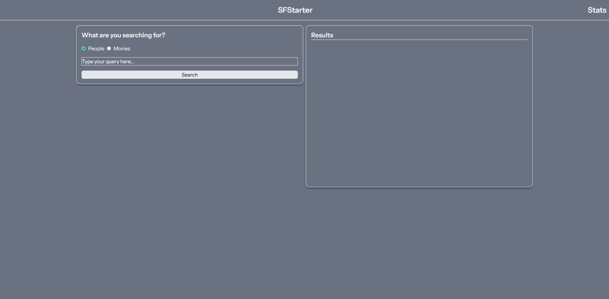

## Mando - The SFStarter of the future



### Running the app

create `.env` file

```sh
cp .env.example .env
```

run `docker compose` to setup the containers

```sh
docker compose -f compose.dev.yaml up --build
```

after some setup you'll see some `Fatal error:` messages in the log. That means you need to install the projects dependencies.

open another terminal and run the following commands

```sh
docker exec -it mando-workspace-1 bash
```

this will open a shell into docker, once in, run:

```sh
npm install
npm run build
composer install
```

then close that terminal, and cancel the `docker compose` task, then restart it.

```sh
docker compose -f compose.dev.yaml up --build
```

Navigate to http://localhost:8080

### Note:

subsequent app starts can omit the `--build` option.
